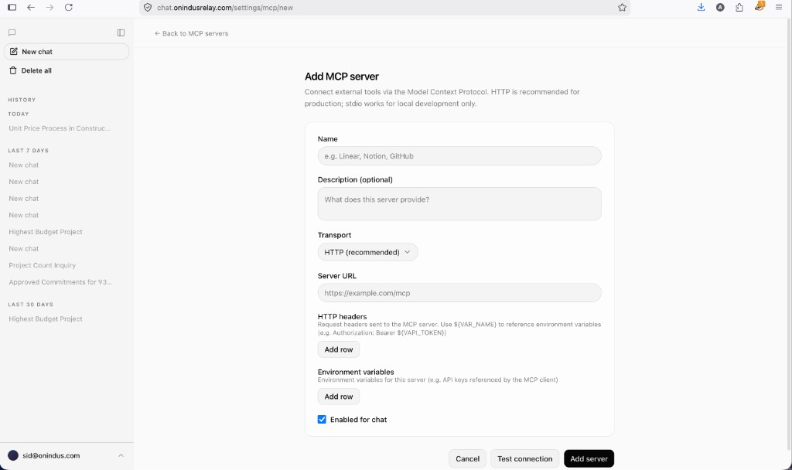

# e-Builder Chatbot + Agent MCP

Monorepo with two apps:

| App | Path | Role |
| --- | --- | --- |
| **Chatbot** | `vercel-nextjs-chatbot/` | Next.js AI chat UI (Auth.js, Postgres, Redis, OpenAI, Browserbase, GCS) |
| **Agent MCP** | `ebuilder-agent-mcp/` | MCP server for Unity Construct (e-Builder) APIs — stdio or HTTP on `/mcp` |

Wire them together **manually** in the chatbot under **Settings → MCP servers** (`/settings/mcp/new`) — see [§4](#4-add-mcp-server-in-the-chatbot-ui-required).

## Prerequisites

- **Node.js** `>= 20`
- **pnpm** `10.x` (chatbot; lockfile uses `pnpm@10.32.1`)
- **npm** (MCP package uses `package-lock.json`)
- **Docker** (optional, for container runs)
- Postgres + Redis reachable via URLs in the chatbot env
- e-Builder API credentials for the MCP server

---

## 1. Environment

### Chatbot — `vercel-nextjs-chatbot/.env`

```bash
cp vercel-nextjs-chatbot/.env.example vercel-nextjs-chatbot/.env
```

Fill at least:

| Variable | Purpose |
| --- | --- |
| `AUTH_SECRET` | Auth.js secret (`openssl rand -base64 32`) |
| `AUTH_TRUST_HOST` | `true` for Docker / reverse proxies |
| `OPENAI_API_KEY` | LLM access |
| `POSTGRES_URL` | Neon / Postgres connection string |
| `REDIS_URL` | Redis connection string |
| `GCS_BUCKET_NAME` / `GCS_PROJECT_ID` | File uploads |
| `BROWSERBASE_API_KEY` | Cloud browser tools (optional) |
| `AUTH_URL` | Public URL when using Docker (e.g. `http://localhost:3002`) |

### MCP — `ebuilder-agent-mcp/.env`

```bash
cp ebuilder-agent-mcp/.env.example ebuilder-agent-mcp/.env
```

Fill at least:

| Variable | Purpose |
| --- | --- |
| `EBUILDER_BASE_URL` | e-Builder API base (default US2 in example) |
| `EBUILDER_USERNAME` / `EBUILDER_PASSWORD` | Password-grant auth |
| `PORT` | HTTP listen port (default `8080`) |
| `MCP_API_KEY` | Optional bearer key for `/mcp` |
| `MCP_ALLOWED_HOSTS` | Host allowlist for HTTP MCP (see example) |

Do not commit `.env` files.

---

## 2. Run without Docker (local commands)

Start the MCP server first if the chatbot will call it over HTTP.

### A. eBuilder Agent MCP

```bash
cd ebuilder-agent-mcp
npm install
npm run build
```

**HTTP** (for remote / chatbot HTTP transport):

```bash
npm run start:http
# → http://0.0.0.0:8080/mcp
# Health: GET http://localhost:8080/health
```

**Stdio** (for chatbot stdio transport — chatbot spawns the process):

```bash
npm start
# or point Settings at: node <absolute-path>/ebuilder-agent-mcp/build/index.js
```

Smoke check (optional):

```bash
npm run smoke-test
```

### B. Vercel Next.js Chatbot

```bash
cd vercel-nextjs-chatbot
pnpm install
pnpm db:migrate
pnpm user:create --email you@example.com --password 'your-password'   # optional
pnpm dev
```

App: [http://localhost:3000](http://localhost:3000)

Production-style local run:

```bash
pnpm build
pnpm start
```

After the chatbot is up, **manually register the MCP server** in the UI (it is not auto-connected). See [§4 Add MCP server in the chatbot UI](#4-add-mcp-server-in-the-chatbot-ui-required).

---

## 3. Run with Docker

Build and run from the **repo root**. Env files are not baked into images (see `.dockerignore`); pass them at runtime with `--env-file`.

### A. eBuilder Agent MCP

```bash
docker build -t ebuilder-agent-mcp -f ebuilder-agent-mcp/Dockerfile ebuilder-agent-mcp

docker run --rm -p 8080:8080 \
  --env-file ebuilder-agent-mcp/.env \
  ebuilder-agent-mcp
```

- MCP: [http://localhost:8080/mcp](http://localhost:8080/mcp)
- Health: [http://localhost:8080/health](http://localhost:8080/health)

### B. Vercel Next.js Chatbot

Migrations are not run inside the image. Apply them once against your DB (from a machine with the app deps):

```bash
cd vercel-nextjs-chatbot && pnpm install && pnpm db:migrate
```

Then build and run:

```bash
docker build -t vercel-nextjs-chatbot -f vercel-nextjs-chatbot/Dockerfile vercel-nextjs-chatbot

# Map host 3002 → container 8080; AUTH_URL must match the browser URL
docker run --rm -p 3002:8080 \
  --env-file vercel-nextjs-chatbot/.env \
  -e AUTH_URL=http://localhost:3002 \
  -e AUTH_TRUST_HOST=true \
  vercel-nextjs-chatbot
```

App: [http://localhost:3002](http://localhost:3002)

If the chatbot container should reach MCP on the host:

- macOS/Windows Docker Desktop: use `http://host.docker.internal:8080/mcp` in MCP settings
- Or put both on a user-defined bridge network and use the MCP service hostname

Example network:

```bash
docker network create ebuilder-net

docker run -d --name ebuilder-mcp --network ebuilder-net -p 8080:8080 \
  --env-file ebuilder-agent-mcp/.env \
  ebuilder-agent-mcp

docker run -d --name chatbot --network ebuilder-net -p 3002:8080 \
  --env-file vercel-nextjs-chatbot/.env \
  -e AUTH_URL=http://localhost:3002 \
  -e AUTH_TRUST_HOST=true \
  vercel-nextjs-chatbot
```

Then open the chatbot and **manually add the MCP connector** (same UI as local). Use Server URL `http://ebuilder-mcp:8080/mcp` when both containers share `ebuilder-net`, or `http://localhost:8080/mcp` / `http://host.docker.internal:8080/mcp` when the Next.js server can reach the published MCP port. Full field values: [§4](#4-add-mcp-server-in-the-chatbot-ui-required).

---

## 4. Add MCP server in the chatbot UI (required)

The chatbot does **not** auto-discover `ebuilder-agent-mcp`. After both apps are running, open **Settings → MCP servers → Add** (or go to `/settings/mcp/new`) and fill the form yourself.



### Recommended: HTTP (local or Docker)

| Field | Value |
| --- | --- |
| **Name** | `ebuilder-agent-mcp` |
| **Description (optional)** | `Unity Construct (e-Builder) domain tools` |
| **Transport** | `HTTP (recommended)` |
| **Server URL** | Local: `http://localhost:8080/mcp` · Same Docker network: `http://ebuilder-mcp:8080/mcp` · Chatbot-in-Docker → MCP on host: `http://host.docker.internal:8080/mcp` · Deployed: `https://<your-mcp-host>/mcp` |
| **HTTP headers** | Only if `MCP_API_KEY` is set in MCP `.env`: Key `Authorization`, Value `Bearer ${MCP_API_KEY}` (or paste `Bearer <your-key>`). Leave empty if no API key. |
| **Environment variables** | Usually leave empty for HTTP (credentials live in the MCP process `.env`). Optional rows if your deployment expects them: `EBUILDER_USERNAME`, `EBUILDER_PASSWORD`, `EBUILDER_BASE_URL` |
| **Enabled for chat** | Checked |

Then click **Test connection**. On success, click **Add server**.

### Alternative: stdio (local development only)

| Field | Value |
| --- | --- |
| **Name** | `ebuilder-agent-mcp` |
| **Description (optional)** | `Unity Construct (e-Builder) domain tools` |
| **Transport** | `stdio` |
| **Command** | `node` |
| **Args** | Absolute path to the built entry, e.g. `/Users/you/.../ebuilder-agent-mcp/build/index.js` (one arg row) |
| **Environment variables** | `EBUILDER_BASE_URL` = `https://api2-us2.e-builder.net` (or your tenant) · `EBUILDER_USERNAME` = your user · `EBUILDER_PASSWORD` = your password |
| **Enabled for chat** | Checked |

Stdio only works when the chatbot process can spawn Node on the same machine (not for production / Cloud Run chatbot).

### Tips

- Start MCP (`npm run start:http` or Docker) **before** testing the connection.
- Confirm health: `curl http://localhost:8080/health`
- Header values may use `${VAR_NAME}` to read from the **chatbot** environment (e.g. put `MCP_API_KEY` in `vercel-nextjs-chatbot/.env` if you use `Bearer ${MCP_API_KEY}`).

---

## Quick reference

| Goal | Command |
| --- | --- |
| MCP local HTTP | `cd ebuilder-agent-mcp && npm run start:http` |
| Chatbot local dev | `cd vercel-nextjs-chatbot && pnpm dev` |
| MCP Docker | `docker build … ebuilder-agent-mcp` then `docker run -p 8080:8080 --env-file …` |
| Chatbot Docker | `docker build … vercel-nextjs-chatbot` then `docker run -p 3002:8080 -e AUTH_URL=…` |
| DB migrate | `cd vercel-nextjs-chatbot && pnpm db:migrate` |
| Create user | `cd vercel-nextjs-chatbot && pnpm user:create --email … --password …` |
| Register MCP in UI | Chatbot → Settings → MCP servers → Add (`/settings/mcp/new`) — [§4](#4-add-mcp-server-in-the-chatbot-ui-required) |

## Notes

- Chatbot Docker image listens on **8080** inside the container (`PORT` / Cloud Run). Set `AUTH_URL` to the URL you open in the browser or Auth.js callbacks break.
- MCP Docker image runs `node build/http.js` (HTTP only). Use local `npm start` / stdio for stdio transport.
- CI deploys both images to Cloud Run (see `.github/workflows/*-deploy-*.yml`).
