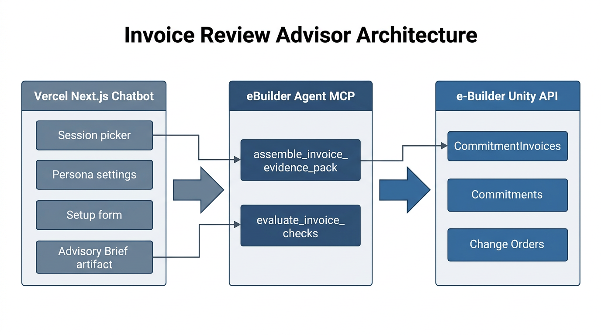

# Invoice Review Advisor — architecture

**Status:** Implemented  
**Scope:** Demo / advisory copilot for construction invoice review

## Overview

The Invoice Review Advisor is a dedicated chat session type that helps a human reviewer analyze commitment invoices against contract, SOV, change orders, and prior draws. It combines:

1. **Vercel Next.js chatbot** — session UX, personas, per-chat config, advisory brief artifact
2. **eBuilder Agent MCP** — evidence gathering and deterministic checks against e-Builder Unity APIs
3. **e-Builder PMIS** — source of truth for invoice, commitment, CO, and retainage data

The agent **never writes back** to e-Builder. Output is an advisory brief the reviewer uses to approve or return the invoice manually.



## Components

### Chatbot (`vercel-nextjs-chatbot/`)

| Area | Path | Role |
|------|------|------|
| Session type | `session-type-picker.tsx`, `Chat.sessionType = invoice_review` | Third card on home screen |
| Per-chat config | `invoiceReviewConfig` jsonb on `Chat` | Persona + tolerances + enabled checks |
| Setup form | `components/chat/invoice-review-setup-form.tsx` | Pre-chat persona/tolerance/check selection |
| System prompt | `lib/invoice-review/prompts.ts` | Injects persona + workflow + config JSON |
| Personas | `Persona` table, `/api/personas`, settings UI | Review style and default thresholds |
| Artifact | `artifacts/advisory-brief/` | Structured flags, passed checks, recommendation |
| PDF entry | `getChatUploads`, file upload route | Extract text from uploaded invoice PDFs |

### MCP server (`ebuilder-agent-mcp/`)

| Tool | Path | Role |
|------|------|------|
| `assemble_invoice_evidence_pack` | `src/services/evidence-pack.ts` | Queries e-Builder; returns normalized `EvidencePack` |
| `evaluate_invoice_checks` | `src/checks/evaluate.ts` | Runs deterministic checks; returns flags + passed list |

Supporting modules:

- `src/checks/normalize.ts` — maps raw API records to typed structures
- `src/checks/defaults.ts` — smart tolerance defaults from commitment fields
- `src/checks/evaluate.test.ts` — unit tests for check logic

Prompts updated in `server-instructions.ts`, `domain-guides.ts`, `question-recipes.ts`.

### Database (migration `0010_invoice_review_advisor.sql`)

```sql
-- Chat.invoiceReviewConfig jsonb
-- Persona table: name, slug, instructions, defaultTolerances, defaultEnabledChecks, enabled
-- Document.kind includes advisory-brief
```

Run after fixing `POSTGRES_URL`:

```bash
cd vercel-nextjs-chatbot
npx tsx lib/db/migrate
```

## Data flow


1. User picks **Invoice Review Advisor** and completes the setup form (persona + tolerances + checks).
2. Config is saved on the `Chat` row and injected into the system prompt.
3. User identifies an invoice via e-Builder reference **or** PDF upload.
4. Agent calls **`assemble_invoice_evidence_pack`** → normalized pack with citations (`ref` on each entity).
5. Agent calls **`evaluate_invoice_checks`** with the pack + exact `tolerances` / `enabledChecks` from chat config.
6. Agent may add narrative flags for AI-assisted checks (`PROGRESS`, `RFI_SCOPE`) using pack context only.
7. Agent calls **`createDocument`** with kind `advisory-brief` and structured JSON content.
8. Human reviewer reads the brief and acts in e-Builder outside the chatbot.

## Evidence pack shape

The pack is the contract between MCP tools and the agent. Key sections:

| Section | Source APIs | Used by |
|---------|-------------|---------|
| `invoice` | CommitmentInvoices + line items | All checks |
| `commitment` | Commitments + SOV | Over-billing, retainage, front-loading |
| `priorInvoices` | Historical draws | Duplicates, large-period, front-loading |
| `changeOrders` | Approved / pending COs | CO coverage, ceiling |
| `retainage` | Invoice + commitment % | Retainage check |

Every flag returned by `evaluate_invoice_checks` includes **citations** (refs from the pack).

## Deterministic checks

| Code | Type | Description |
|------|------|-------------|
| `OVER_BILLING` | Deterministic | Cumulative billing vs SOV / contract ceiling |
| `DUPLICATE` | Deterministic | Duplicate lines / stored materials patterns |
| `RETAINAGE` | Deterministic | Withheld % vs contract retainage |
| `MATH` | Deterministic | Rates, tax, arithmetic reconciliation |
| `CO_UNAPPROVED` | Deterministic | Billed work not covered by approved CO |
| `FRONT_LOADING` | Deterministic | Line billed above trailing average |
| `LARGE_PERIOD` | Deterministic | Draw vs trailing average |
| `PROGRESS` | AI-assisted | Progress plausibility (agent narrative) |
| `RFI_SCOPE` | AI-assisted | Scope tied to open RFI (agent narrative) |

Checks honor `enabledChecks` and `tolerances` from the per-chat config (seeded from persona defaults).

## Personas

Personas bundle **review instructions**, **default tolerances**, and **default check toggles**. Four personas are seeded on first API load:

- Conservative Auditor
- Fast-Track PM
- Retainage Hawk
- Owner's Rep

Settings UI: **User menu → Review personas** (`/settings/personas`).


Create/edit form:


See [features/personas.md](../features/personas.md).

## Advisory brief artifact

Kind: `advisory-brief`. Content schema in `lib/invoice-review/types.ts` (`AdvisoryBriefContent`):

- Risk rating (`LOW` | `MEDIUM` | `HIGH`)
- Contract summary
- Flags (code, severity, amount, message, citations)
- Passed checks
- Recommendation (advisory text only)

Rendered in the artifact panel with severity styling.

## MCP setup

Connect the e-Builder Agent MCP server in chat settings before starting a session:


Rebuild and restart the MCP HTTP server after pulling changes so new tools are registered.

## Out of scope (demo)

- Write-back (approve / return invoice in e-Builder)
- Three-way matching (stored materials verification)
- Granular MCP tools (`get_invoice`, etc.) — orchestrator-only for now
- RFI retrieval without tenant `processPrefix` configuration

## Key file index

```
vercel-nextjs-chatbot/
  lib/invoice-review/          # types, defaults, prompts
  lib/personas/                # types, defaults, scope, utils
  components/chat/invoice-review-setup-form.tsx
  components/settings/persona-form.tsx
  components/settings/personas-settings.tsx
  artifacts/advisory-brief/
  app/(chat)/api/personas/
  lib/db/migrations/0010_invoice_review_advisor.sql

ebuilder-agent-mcp/
  src/services/evidence-pack.ts
  src/tools/assemble-invoice-evidence-pack.ts
  src/tools/evaluate-invoice-checks.ts
  src/checks/
```
