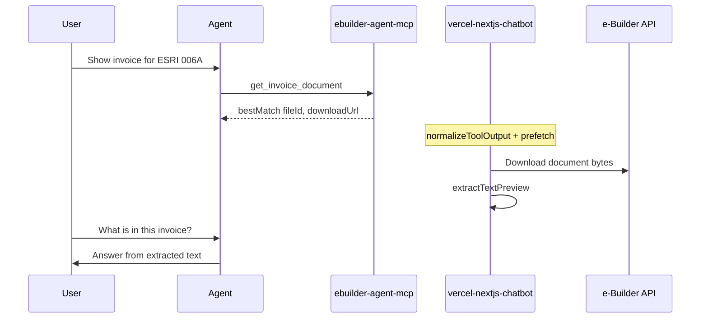

# Unified Document Access — architecture

**Status:** Implemented  
**Scope:** Monorepo feature spanning `vercel-nextjs-chatbot` + `ebuilder-agent-mcp`

## Overview

The agent can answer **document content questions** (line items, totals, vendor info, dates) for:

1. **Chat attachments** — uploaded to GCS; text extracted at upload time  
2. **e-Builder documents** — resolved via MCP, downloaded by the chatbot, text extracted on demand  

Before this feature, e-Builder documents opened in the **file-preview** panel only; the model saw metadata but not document text.


## Repositories

| Package | Role |
|---------|------|
| [`vercel-nextjs-chatbot`](../vercel-nextjs-chatbot/) | Fetch bytes, extract text, system prompt injection, `getLinkedDocuments` tool, UI render routes |
| [`ebuilder-agent-mcp`](../ebuilder-agent-mcp/) | Document discovery (`search_documents`, `get_invoice_document`); metadata + `agentDirective` |

Detailed architecture: [vercel-nextjs-chatbot/docs/architecture/unified-document-access.md](../vercel-nextjs-chatbot/docs/architecture/unified-document-access.md)

MCP role: [ebuilder-agent-mcp/docs/unified-document-access.md](../ebuilder-agent-mcp/docs/unified-document-access.md)

## End-to-end workflow




## Key design decisions

| Decision | Rationale |
|----------|-----------|
| Fetch on **host**, not MCP | MCP runs separately; host holds e-Builder creds and shares extract pipeline with uploads |
| **normalizeToolOutput** | MCP wraps JSON in `{ content: [{ text }] }`; parser must unwrap before reading `bestMatch` |
| **fileId** preferred over URL | Refreshes expired signed DownloadURLs via Documents Query |
| **SSRF allowlist** | Only e-Builder S3 / e-builder hostnames for direct URL fetch |
| Same-turn **prefetch** | `onStepFinish` after MCP tools populates cache before next agent step |

## Configuration

Set on **both** MCP server env and chatbot `.env`:

```bash
EBUILDER_BASE_URL=https://api2-us2.e-builder.net
EBUILDER_USERNAME=...
EBUILDER_PASSWORD=...
```

## Related

- [Feature guide](../features/unified-document-access.md)
- [Invoice Review Advisor](./invoice-review-advisor.md) — invoice sessions use the same document tools for preview + Q&A
