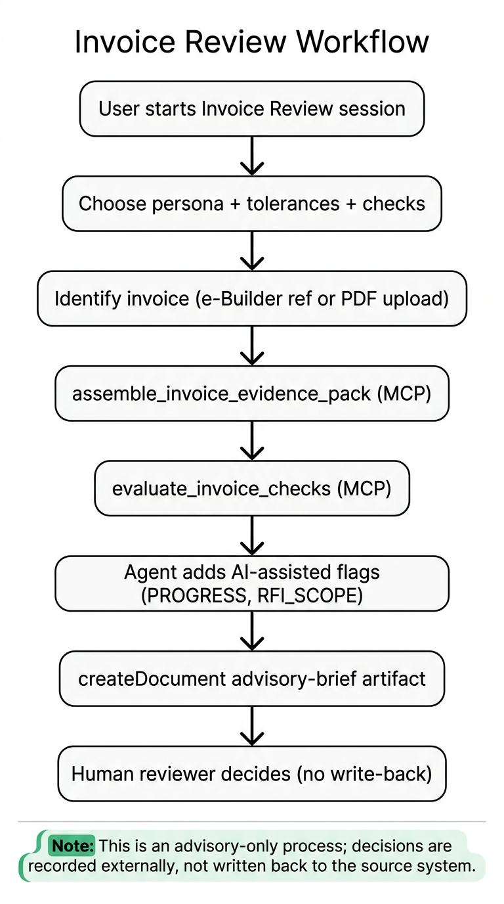

# Invoice Review Advisor — user guide

Start an advisory invoice review session from the chat home screen.

## Prerequisites

1. **Postgres** — run migration `0010_invoice_review_advisor.sql` (`npx tsx lib/db/migrate`).
2. **e-Builder MCP** — add and enable the e-Builder Agent MCP server in settings (see [add-mcp-server.png](../images/add-mcp-server.png)).
3. **e-Builder credentials** — configured in user secrets / MCP env as for other e-Builder sessions.

## Start a session

1. Click **Invoice Review Advisor** on the session type picker.
2. On the setup form:
   - Choose a **review persona**
   - Adjust **tolerance thresholds** (defaults come from the persona)
   - Toggle **deterministic checks** (all on by default)
3. Click **Start invoice review session**.

## Provide an invoice

Two entry modes:

| Mode | How |
|------|-----|
| e-Builder reference | Tell the agent project, commitment, and invoice number (or let it search) |
| PDF upload | Attach an invoice PDF; agent uses extracted text + e-Builder reconciliation |

Example kickoff messages:

```text
Review commitment invoice INV-2024-042 on project Oak Tower, commitment C-104.
```

```text
I've attached the subcontractor invoice PDF — please reconcile against e-Builder.
```

## What the agent does

The agent follows a fixed workflow (see [architecture](../architecture/invoice-review-advisor.md)):

1. `assemble_invoice_evidence_pack`
2. `evaluate_invoice_checks` with your session tolerances and check toggles
3. `createDocument` → **Advisory Brief** artifact

Open the artifact panel to read flags, passed checks, and the recommendation.

## Advisory only

The agent **does not** approve, return, or modify invoices in e-Builder. You remain the approver.

## Personas

Customize review style under **Settings → Review personas**. See [personas.md](./personas.md).

## Workflow diagram


