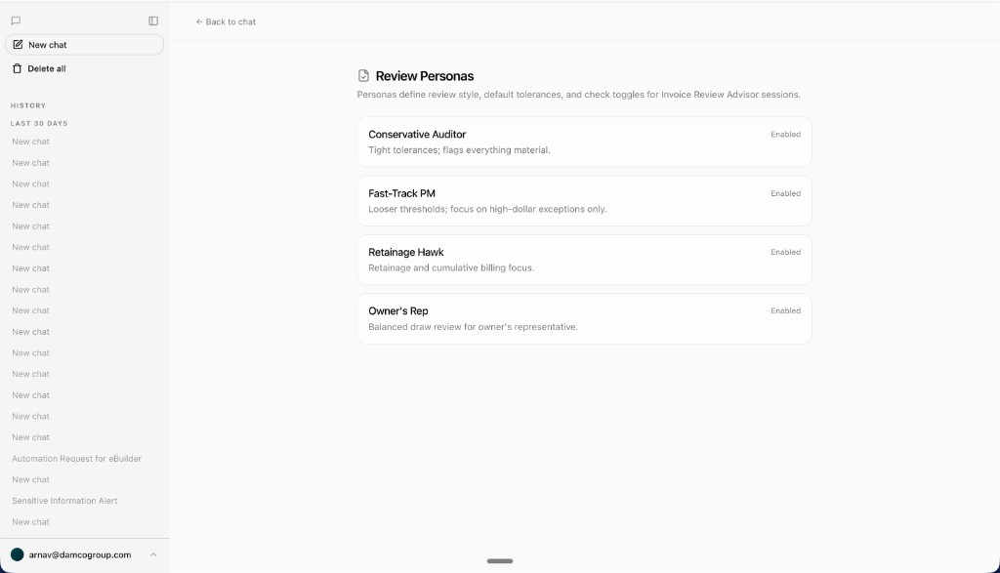
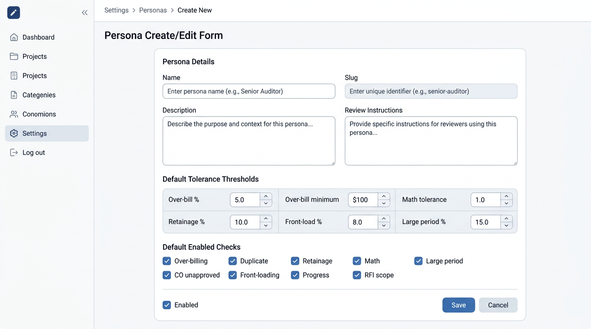

# Review personas

Personas define how the Invoice Review Advisor behaves: review tone, default tolerance thresholds, and which checks start enabled.

## Open settings

**User menu → Review personas** → `/settings/personas`

## Seeded personas

On first load, four personas are created automatically:

| Persona | Focus |
|---------|--------|
| Conservative Auditor | Tight tolerances; flags material variances |
| Fast-Track PM | High-dollar exceptions only |
| Retainage Hawk | Retainage and cumulative billing |
| Owner's Rep | Balanced draw review |
| Full Spectrum Analyst | All nine checks + cross-draw trend analysis (one-pager aligned) |

## Create a persona

1. Click **Add persona**.
2. Fill in the form:

| Field | Purpose |
|-------|---------|
| Name | Display label in setup form and settings |
| Slug | Stable identifier (lowercase, hyphens) |
| Description | Short summary in persona picker |
| Review instructions | Injected into the system prompt for sessions using this persona |
| Default tolerance thresholds | Starting values on the setup form (user can override per chat) |
| Default enabled checks | Which deterministic checks start ON |
| Enabled | Whether the persona appears in the setup form |

3. Click **Create persona**.

Route: `/settings/personas/new`

## Edit a persona

From the list, click **Edit** on a card → `/settings/personas/[id]/edit`.

Changes affect **new sessions** that select the persona. Existing chats keep their saved `invoiceReviewConfig`.

## Enable / disable

Use **Enable** / **Disable** on the list without opening the full form. Disabled personas are hidden from the invoice review setup form.

## Delete

Click the trash icon and confirm. Deletion is permanent.

## API

| Method | Path | Action |
|--------|------|--------|
| GET | `/api/personas` | List (seeds defaults if empty) |
| POST | `/api/personas` | Create |
| GET | `/api/personas/[id]` | Get one |
| PATCH | `/api/personas/[id]` | Update |
| DELETE | `/api/personas/[id]` | Delete |

Personas are scoped per signed-in user (`Persona.userId`).

## Implementation files

- `components/settings/personas-settings.tsx` — list UI
- `components/settings/persona-form.tsx` — create/edit form
- `lib/personas/defaults.ts` — seed templates
- `lib/personas/types.ts` — validation schemas
