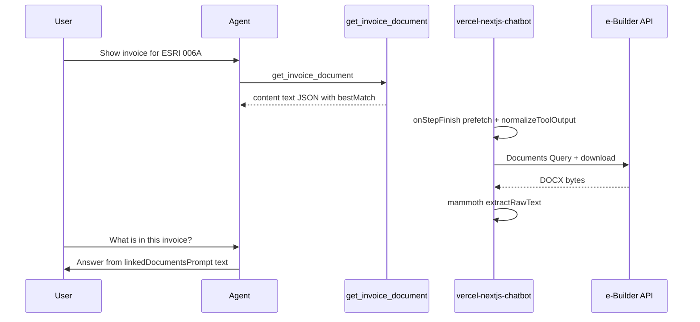

# Unified Document Access — eBuilder Agent MCP

**Status:** Implemented (host chatbot fetches bytes; MCP returns metadata only)

The eBuilder Construct Agent MCP server **discovers** e-Builder documents and returns `fileId`, signed `downloadUrl`, and preview metadata. It does **not** download file bytes or extract text. The **host chatbot** (`vercel-nextjs-chatbot`) performs fetch + text extraction and injects content into the agent context.


## Role split

| Layer | Responsibility |
|-------|----------------|
| **MCP (`ebuilder-agent-mcp`)** | Query Documents API; normalize `bestMatch`; instruct host to use `getLinkedDocuments` |
| **Host chatbot** | Download bytes via `fileId` / `downloadUrl`; `extractTextPreview`; `linkedDocumentsPrompt`; `getLinkedDocuments` tool |
| **UI** | `file-preview` artifact + `/api/documents/render` (visual preview only) |

## Document tools

### `search_documents`

**File:** `src/tools/search-documents.ts`

Queries `Documents` by project, filename pattern, invoice number, or document type. Returns normalized records:

| Field | Description |
|-------|-------------|
| `fileId` | e-Builder document UUID |
| `fileName` | Original filename |
| `downloadUrl` | Signed S3 DownloadURL (may expire) |
| `fileUrl` | Prefer downloadUrl; fallback render/preview paths for UI |
| `contentType` | Inferred MIME from extension |
| `previewable` | true for PDF, images, Word |
| `renderPath` | `/api/documents/render?fileId=...` (host UI) |

### `get_invoice_document`

**File:** `src/tools/get-invoice-document.ts`

Orchestrated flow for invoice document discovery:

1. `resolve_project` → portal scope
2. Query `CommitmentInvoices` for invoice header
3. Retry `search_documents` with filename / invoice patterns
4. Return `bestMatch` (first document with a usable URL)

On success, `agentDirective` tells the host agent to:

- Use `createDocument(file-preview)` for **visual preview**
- Call host **`getLinkedDocuments`** with `bestMatch.fileId` or `downloadUrl` for **content Q&A**

## MCP tool output format

Tools return MCP text content via `toToolResult()`:

```json
{
  "content": [
    {
      "type": "text",
      "text": "{\n  \"status\": \"complete\",\n  \"bestMatch\": {\n    \"fileId\": \"a831914d-2b2c-4e32-8d0f-642ee849c72d\",\n    \"fileName\": \"Cathcart_Construction_Invoice_Receipt.docx\",\n    \"downloadUrl\": \"https://...amazonaws.com/...\"\n  }\n}"
    }
  ]
}
```

The host **must** unwrap this envelope (`normalizeToolOutput`) before reading `bestMatch`. See [host architecture](../../vercel-nextjs-chatbot/docs/architecture/unified-document-access.md).

## Normalization (`document-normalize.ts`)

`normalizeDocument()` maps raw e-Builder Query records to agent-friendly fields:

- `fileUrl` priority: `DownloadURL` → `/api/documents/render?fileId=` → `/api/documents/preview?fileId=`
- `previewable` for PDF, PNG/JPEG, DOC/DOCX
- `ref` for citation: `Documents/{fileId}`

## Prompts (document access)

| File | Document-related guidance |
|------|---------------------------|
| `server-instructions.ts` | Preview vs content Q&A; host calls `getLinkedDocuments` |
| `domain-guides.ts` | Tool descriptions for `search_documents`, `get_invoice_document` |
| `question-recipes.ts` | NL patterns → document tool sequences |

## Host integration checklist

Both MCP **and** host need e-Builder credentials:

```bash
EBUILDER_BASE_URL=https://api2-us2.e-builder.net
EBUILDER_USERNAME=...
EBUILDER_PASSWORD=...
# or EBUILDER_ACCESS_TOKEN=...
```

| Step | Host action |
|------|-------------|
| Register MCP | Settings → MCP → stdio or HTTP (see main [README](../README.md)) |
| Env on chatbot | Same `EBUILDER_*` vars in `vercel-nextjs-chatbot/.env` |
| User flow | Ask to show document → ask content question |
| Agent tools | `getLinkedDocuments({ fileId })` after MCP when text not in prompt |

## Sequence (MCP + host)




## What MCP does NOT do

- Download document bytes
- Extract PDF/DOCX text
- Call host `/api/documents/render`
- Answer "what does this PDF say?" without host `getLinkedDocuments`

## Tests

| File | Covers |
|------|--------|
| `src/tools/search-documents.test.ts` | `normalizeDocument`, previewable DOCX |
| `src/tools/get-invoice-document.test.ts` | Invoice document orchestration |

Host-side tests: `vercel-nextjs-chatbot/lib/documents/*.test.ts`

## Related documentation

- [Host architecture](../../vercel-nextjs-chatbot/docs/architecture/unified-document-access.md)
- [Host feature guide](../../vercel-nextjs-chatbot/docs/features/unified-document-access.md)
- [Repo root overview](../../docs/architecture/unified-document-access.md)
- [Invoice Review Advisor](../../docs/architecture/invoice-review-advisor.md) — uses same MCP + advisory workflow
