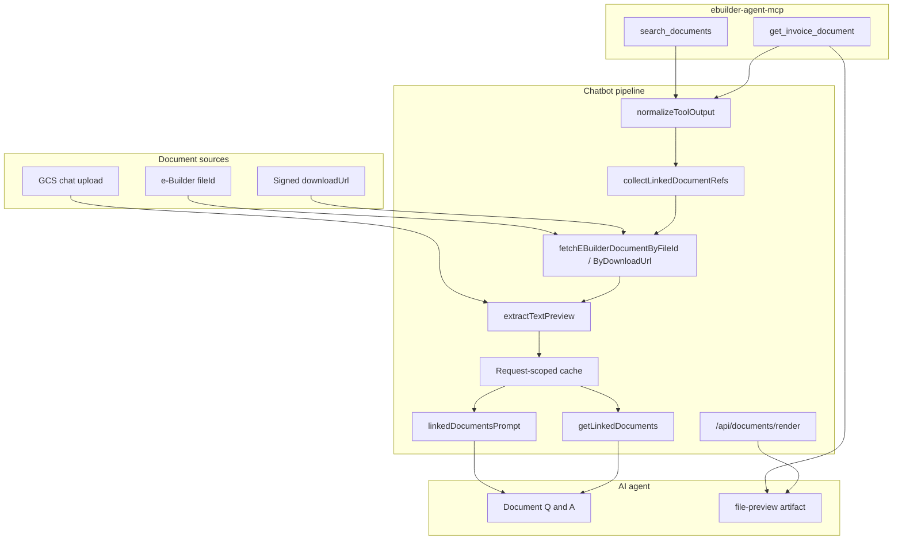
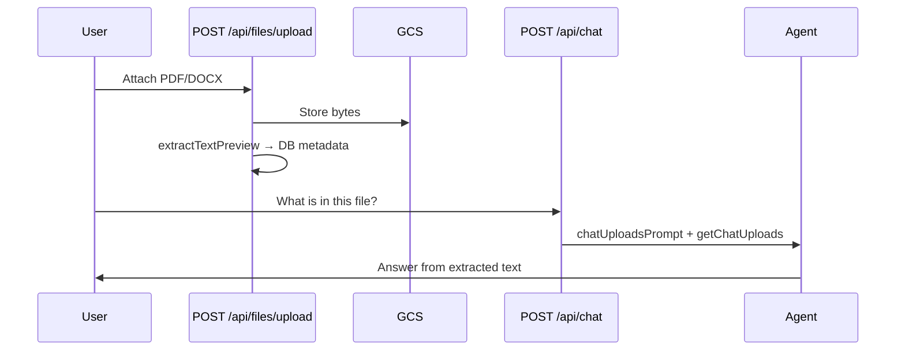
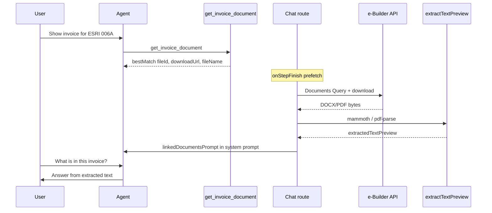

# Unified Document Access — architecture

**Status:** Implemented  
**Scope:** Chat uploads (GCS) + e-Builder linked documents (fileId / signed downloadUrl)

## Overview

The agent can answer **document content questions** (line items, totals, vendor info) for:

1. **Files uploaded in chat** — stored in GCS, text extracted at upload time  
2. **e-Builder documents** — resolved by MCP (`search_documents`, `get_invoice_document`), fetched server-side, text extracted on demand  

Previously, e-Builder documents only opened in the **file-preview** side panel; the model received metadata (`fileName`, `fileId`, `downloadUrl`) but not extracted text. Unified Document Access closes that gap using one shared fetch + extract pipeline.


## High-level architecture



## Component map

### Chatbot (`vercel-nextjs-chatbot/`)

| Area | Path | Role |
|------|------|------|
| Unified fetch + extract | `lib/documents/access.ts` | `resolveDocumentContent`, `extractDocumentTextFromBuffer` |
| Ref discovery | `lib/documents/linked-document-refs.ts` | Scan chat history for MCP + file-preview refs |
| MCP output unwrap | `lib/documents/normalize-tool-output.ts` | Parse `{ content: [{ text: "..." }] }` envelopes |
| Linked doc cache | `lib/documents/linked-documents.ts` | `buildLinkedDocumentAccessList`, same-turn prefetch |
| System prompt | `lib/ai/prompts-linked-documents.ts` | Injects extracted text (~4k chars) |
| Agent tool | `lib/ai/tools/get-linked-documents.ts` | Full text (8k cap), refresh by fileId/URL |
| e-Builder download | `lib/ebuilder/documents.ts` | Auth, query by fileId, signed URL fetch |
| URL allowlist | `lib/ebuilder/download-url-policy.ts` | SSRF protection for download URLs |
| Text extraction | `lib/storage/extract-text.ts` | PDF, DOCX, TXT, CSV, XLSX |
| Chat wiring | `app/(chat)/api/chat/route.ts` | Auto-inject + prefetch on MCP step finish |
| UI preview | `app/(chat)/api/documents/render/route.ts` | Inline PDF/image/DOCX HTML (browser only) |

### MCP server (`ebuilder-agent-mcp/`)

| Tool | Role in document access |
|------|-------------------------|
| `search_documents` | Returns `fileId`, `downloadUrl`, `fileName`, `contentType` |
| `get_invoice_document` | Orchestrates invoice lookup → document search → `bestMatch` |

MCP returns **metadata only** — no file bytes. The **host chatbot** fetches and extracts text. See [ebuilder-agent-mcp/docs/unified-document-access.md](../../../ebuilder-agent-mcp/docs/unified-document-access.md).

## Data flows

### A. Chat upload (existing, unchanged)



### B. e-Builder linked document (new)



### C. Same-turn vs follow-up

| Timing | How agent gets text |
|--------|---------------------|
| **Follow-up message** | `collectLinkedDocumentRefs(uiMessages)` → `buildLinkedDocumentAccessList` → `linkedDocumentsPrompt` |
| **Same turn (after MCP)** | `onStepFinish` → `prefetchLinkedDocumentsFromToolOutput` → `getLinkedDocuments` cache |
| **Explicit refresh** | Agent calls `getLinkedDocuments({ fileId })` or `{ downloadUrl }` |

## MCP tool output normalization (critical)

e-Builder MCP tools return results via `toToolResult()`:

```json
{
  "content": [
    {
      "type": "text",
      "text": "{ \"status\": \"complete\", \"bestMatch\": { \"fileId\": \"...\", \"downloadUrl\": \"...\" } }"
    }
  ]
}
```

`normalizeToolOutput()` unwraps this envelope before `collectLinkedDocumentRefs` reads `bestMatch`. Without it, the agent sees the document in the UI but **no extracted text**.

## Security

| Rule | Implementation |
|------|----------------|
| SSRF protection | `isAllowedEBuilderDownloadUrl()` — e-Builder S3 hosts and `e-builder` domains only |
| Prefer fileId | Refreshes expired signed URLs via Documents Query API |
| No arbitrary URLs | External `https://evil.com/...` rejected |
| Credentials | `EBUILDER_USERNAME` / `EBUILDER_PASSWORD` or `EBUILDER_ACCESS_TOKEN` on **chatbot** (not only MCP) |

## Supported file types

| Type | Extraction |
|------|------------|
| PDF | `pdf-parse` |
| DOCX / DOC | `mammoth` (raw text; HTML fallback if empty) |
| TXT / CSV | UTF-8 read |
| XLSX / XLS | First sheet → CSV text (`xlsx`) |
| PPTX | Not supported (use file-preview) |
| Images | Vision URL only; no OCR in v1 |

Text preview cap: **8,000 characters** (system prompt shows first ~4,000; `getLinkedDocuments` returns full cap).

## Configuration

Chatbot `.env` (required for e-Builder document fetch):

```bash
EBUILDER_BASE_URL=https://api2-us2.e-builder.net
EBUILDER_USERNAME=...
EBUILDER_PASSWORD=...
# or EBUILDER_ACCESS_TOKEN=...
```

MCP server needs the same credentials to **discover** documents; the chatbot needs them to **download bytes**.

## Tests

| File | Covers |
|------|--------|
| `lib/documents/normalize-tool-output.test.ts` | MCP content envelope parsing |
| `lib/documents/linked-documents.test.ts` | Ref collection from tool parts |
| `lib/ebuilder/documents.test.ts` | Download URL allowlist |

Run:

```bash
cd vercel-nextjs-chatbot
pnpm exec tsx --test lib/documents/*.test.ts lib/ebuilder/documents.test.ts
```

## Related docs

- [Feature guide — how to use](../features/unified-document-access.md)
- [Invoice Review Advisor](../../../docs/architecture/invoice-review-advisor.md) — uses same MCP + advisory workflow
- [ebuilder-agent-mcp document tools](../../../ebuilder-agent-mcp/docs/unified-document-access.md)
