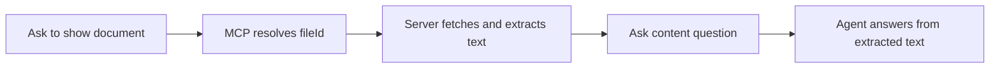

# Unified Document Access — feature guide

## What it does

The agent can read **document contents** from two sources without you re-uploading files:

| Source | Example question |
|--------|------------------|
| **Chat attachment** | “What line items are in the PDF I uploaded?” |
| **e-Builder link** | “What is in the Cathcart Construction invoice for ESRI 006A?” |

For e-Builder documents, the agent uses MCP to find the file, the server downloads it, extracts text, and injects that text into the conversation context.


## User flows

### Upload a document

1. Attach PDF, DOCX, TXT, CSV, or XLSX in the chat input.  
2. Ask a content question — the agent uses **Chat uploads** text in the system prompt.  
3. Optional: call **`getChatUploads`** for the full 8k-character preview.

### e-Builder invoice / document

**Prerequisites:** e-Builder MCP connected; `EBUILDER_*` in both MCP and chatbot `.env`; restart dev server.

1. Ask to show or find a document, e.g. “Show invoice for ESRI 006A”.
2. MCP returns metadata; the UI may show a **file-preview** panel.
3. Ask “What is in this invoice?” — the agent uses **Linked e-Builder documents** text or **`getLinkedDocuments`**.

See [repo feature guide](../../docs/features/unified-document-access.md) for MCP setup screenshots and troubleshooting.



## What the agent sees

When linked documents are active, the system prompt includes:

```text
## Linked e-Builder documents (ACTIVE)
- **Cathcart_Construction_Invoice_Receipt.docx** (application/vnd...docx)
  File ID: a831914d-...
  Extracted text:
  CATHCART CONSTRUCTION CO
  INVOICE RECEIPT
  ...
```

If text is truncated, the agent should call **`getLinkedDocuments`** with the `fileId` from the latest MCP result.

## Agent tools

| Tool | When to use |
|------|-------------|
| `getLinkedDocuments` | Read/refresh e-Builder docs + uploads; pass `fileId` or `downloadUrl` after MCP |
| `getChatUploads` | Upload-only refresh (still available when uploads exist) |
| `get_invoice_document` / `search_documents` | Find document metadata (MCP) |
| `createDocument(file-preview)` | Visual preview only — not for text extraction |

## Troubleshooting

| Symptom | Check |
|---------|--------|
| “No extractable text” but preview works | Restart dev server after pulling latest; verify `normalizeToolOutput` fix is deployed |
| Fetch failed | `EBUILDER_*` credentials in **vercel-nextjs-chatbot** `.env`, not only MCP |
| Same-turn Q&A empty | Agent should call `getLinkedDocuments({ fileId })` after MCP in that turn |
| DOCX empty text | Scanned/image-only Word files need OCR (out of scope v1) |

## Architecture

See [unified-document-access.md](../architecture/unified-document-access.md) for component map, sequence diagrams, and security notes.
